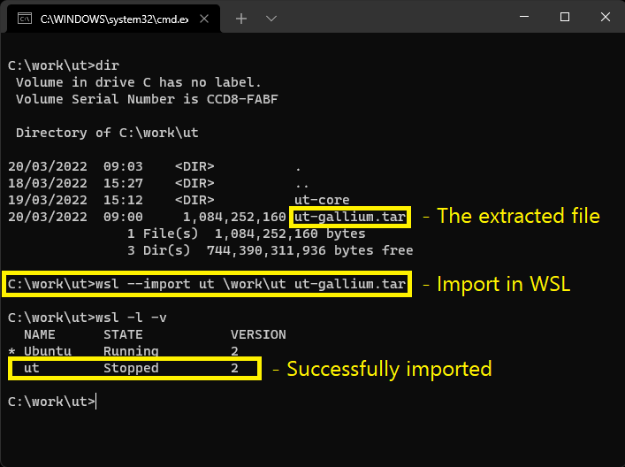
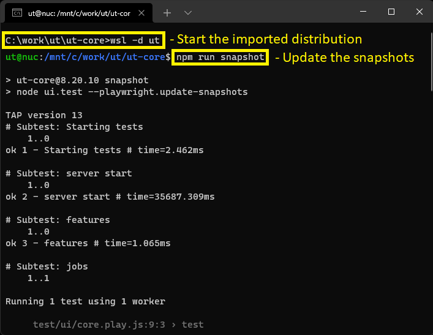

# Using Playwright for UI testing

## Updating the snapshots before commit

As stated in Playwright's docs, different platforms produce different snapshots.
As all test run in Jenkins, under Linux, there are some important things to
take care of:

- The OS and browser version for updating the snapshots in the developer's machine
  should match the ones used in Jenkins. To enable this, we are using images based
  on official node.js docker images, which are based on debian 11. This is done
  by pointing to the gallium branch (jenkinsfile@gallium).
- To update the snapshots when developing locally under Windows 10 or 11, we must
  have a way to do this when Playwright runs under debian. The easiest way is to
  use Windows Subsystem for Linux (WSL) 2.
- The module must include proper scripts and devDependencies for building the
  front end and for running Playwright.

### Installation

> Note: In case you are developing under Linux, it is worth trying to use Playwright
> directly and only if it does not work, you can try other options like Docker).

We have a pre-built WSL distribution to take care of this. It can be used
for updating the screenshots of any module. Here are the instructions to install:

1. [Install WSL 2](https://docs.microsoft.com/en-us/windows/wsl/install)
2. Download from Google Drive the UT WSL distribution
   [ut-gallium.zip](https://drive.google.com/file/d/1xagdFPd-OrnuegWRoYCteueXGe7QIIpE/view?usp=sharing).
3. Extract the archive and run `wsl --import` in the folder
   where you extracted it:
   

Once installed, this distribution can be used to update the snapshots
when there are changes in the test scripts, UI, etc.
Prerequisites before updating the snapshots are :

- Install all dependencies (`npm install`)
- Build the front end (usually with `npm run build`)
- Have a `.testrc` file for accessing the SQL server
  somewhere in the path to the module. Putting it in
  the home folder or other place will not work.
  If you use a hostname to connect to the database,
  you will need to specify the FQDN, i.e. `xxx.softwaregroup-bg.com`
- Have an existing database
  (usually created when running `node .` and when
  db schema updates are enabled in the config)

To update the snapshots use these steps:

1. Open a command prompt in the folder of a module
2. Start the imported distribution with `wsl -d ut`
3. If needed update playwright with `npx playwright install`
4. Update the snapshot with `npm run snapshot`
   

### Advanced usage

Playwright has a number of command line options, described
[here](https://playwright.dev/docs/test-cli#reference).
This module (ut-portal) has a shared step, named `run playwright`
When playwright is started via this step, it will automatically
pass options to Playwright, based on the current configuration.
It will look at the `playwright` key in the configuration.
Any properties under that key will be treated like this:

- when the property has the boolean value `true`, the name of
  the property will be passed to playwright as a single argument: `--name`
- in all other cases two arguments will be passed: `--name value`

The above enables to pass options to playwright from the command
line, as these also affect the configuration. For example, passing
`--playwright.update-snapshots` sets this in the configuration:
`{playwright: 'update-snapshots': true}}` and it will be passed
to playwright as `--update-snapshots`.
